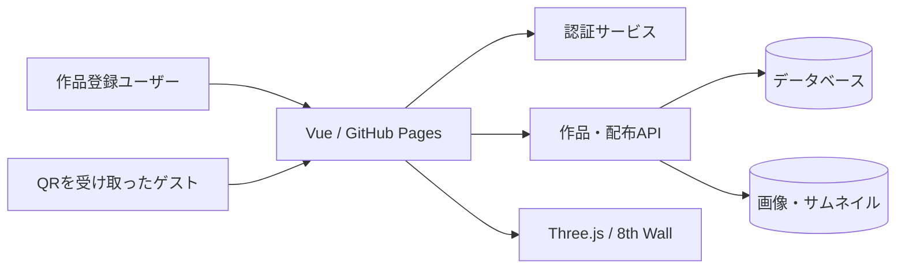

# 本番へ拡張するための設計

## 配置とAPI境界

GitHub Pagesはフロントエンドの静的配信に利用し、認証・作品DB・ストレージ・ゲストの認可は別のバックエンドで実装します。APIキー、署名秘密鍵、管理者権限をフロントエンドに置きません。

既存portfolioが使用しているFirebaseを採用するなら、Firebase Auth + Firestore + Cloud Storage + Cloud Functionsが候補です。現段階ではサービス作成・外部アカウント設定は行っていません。

## 必要なデータ

| エンティティ | 主な項目 | 用途 |
|---|---|---|
| Account | id, organizationId, role, status | 管理者 / 作品登録ユーザー |
| Artwork | id, ownerId, title, artist, imageAssetId, status, revision | 作品、所有者、下書きと公開版 |
| PhysicalSpec | artworkId, widthMm, heightMm, frameMm, matMm, depthMm, measuredAt | 実測値をmm整数で保持 |
| ImageAsset | id, ownerId, storageKey, mimeType, widthPx, heightPx | 画像保存、検証、サムネイル |
| Collection | id, ownerId, title, status | 展示・配布する作品群 |
| CollectionArtwork | collectionId, artworkId, order | 順序と許可作品 |
| GuestGrant | id, collectionId, tokenHash, expiresAt, revokedAt | QRで配布する閲覧権限 |
| AuditEvent | actorId, action, resourceId, createdAt | 更新と配布の履歴 |

作品の実寸とフレーム寸法は別々に保持し、表示時に額装外寸を計算します。更新で過去に配布した展示が意図せず変わらないよう、公開リビジョンをコレクションに固定できる設計にします。

## 役割

- 管理者：組織内のアカウント・作品・配布権限を管理。
- 作品登録ユーザー：所有する作品・画像・寸法・コレクションを作成・更新。
- ゲスト：配布トークンで許可された公開作品のみを取得し、AR体験。管理UI・書き込み権限はなし。

画面で非表示にするだけでは認可になりません。全API、画像取得、DBルールで所有者とゲストの許可範囲を確認します。

## 想定API

- `GET /v1/me`：自分の権限。
- `GET/POST /v1/artworks`：本人が操作できる作品。
- `PATCH /v1/artworks/:id`：画像と寸法の検証・保存。リビジョン付き更新。
- `POST /v1/assets/uploads`：アップロード先を発行。画像種別・サイズ・所有者を検証。
- `GET/POST/PATCH /v1/collections`：公開対象を編集。
- `POST /v1/guest-grants`：有効期限・対象コレクション付きの推測困難なトークンを発行。
- `DELETE /v1/guest-grants/:id`：失効。
- `GET /v1/guest/:token/collection`：サーバーでトークンを検証し、許可された作品だけを返す。

ゲスト画像は必要に応じて有効期限付きURLを使用。長寿命QRには作品IDや管理アカウントのIDを直接埋め込まず、失効可能な閲覧権限を参照させます。

## デモからの置き換え

1. `public/catalog.json` 読み込みを公開コレクションAPIへ。
2. `storage.js` の保存を認証付きリポジトリ層へ。UIのバリデーションは保持し、サーバーでも再検証。
3. データURL画像をオブジェクトストレージのアセットIDへ。
4. 管理UIへログイン・ロール別ナビゲーションを接続。
5. `?collection=` を失効可能なゲスト権限URLへ。公開JSONに非公開作品を含めない。
6. 実機での認識率、寸法誤差、追跡復帰を測定。必要に応じてネイティブ/商用認識方式や基準マーカーを追加。

AR座標計算は `src/ar/` に分離しているため、作品DB・認証の導入と独立して改善できます。
